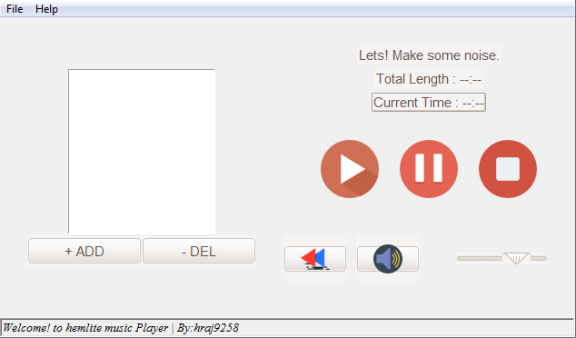

<h1>Hemlite - Python based Music Player</h1>
<h3>This is the initial release, v:0.1, Their is more to come.</h3> 
It can Play .mp3 and .wav
Based on Tkinter, Mutagen, and Pygame Library
</img>

## Features ##
- Theme : You have to change it in source code 
- Playlist : it can be used to add and play more than one music
- StatusBar : Show the current status of Music Player  

